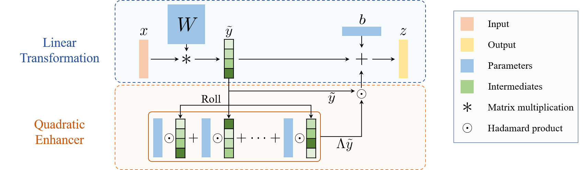

# QuadEnhancer: Leveraging Quadratic Transformations to Enhance Deep Neural Networks

[](https://neurips.cc/virtual/2025/loc/san-diego/poster/118178)
[](https://arxiv.org/pdf/2510.03276)


> Official PyTorch implementation of the paper **[QuadEnhancer: Leveraging Quadratic Transformations to Enhance Deep Neural Networks](https://arxiv.org/pdf/2510.03276)** (NeurIPS 2025).

QuadEnhancer introduces a novel architectural enhancement that leverages quadratic transformations to boost the representation power of Deep Neural Networks (DNNs). It is designed to be a drop-in replacement for standard linear layers, offering three key advantages:

- **🚀 Enhanced Non-linearity:** Introduces quadratic transforms to capture complex data relationships more effectively.
- **⚡ Minimal Overhead:** Achieves performance gains with negligible increase in parameters and FLOPs.
- **🧩 Universally Applicable:** Compatible with various architectures (Transformers, MLPs) as a direct substitute for linear layers.



## Usage

We provide a high-performance implementation of `QuadEnhancedLinear` with custom kernel support via **Triton** in [quadratic_enhancer.py](./quadratic_enhancer.py). Below are two methods to integrate QuadEnhancer into your projects.

### Method 1: Constructing a Model from Scratch
You can use the `QuadEnhancedLinear` class as a fundamental building block, exactly like `torch.nn.Linear`.

```python
import torch.nn as nn
from quadratic_enhancer import QuadEnhancedLinear

# Example: A simple 2-layer MLP
inp_dim, hid_dim, out_dim = 128, 256, 10

my_model = nn.Sequential(
    QuadEnhancedLinear(inp_dim, hid_dim, bias=True),
    nn.ReLU(inplace=True),
    QuadEnhancedLinear(hid_dim, out_dim, bias=True)
)

```

### Method 2: Replacing Linear Layers (Monkey Patching)
If you wish to upgrade an existing codebase or model definition without rewriting the class structure, you can monkey-patch `torch.nn.Linear`.

⚠️ Important: You must assign the replacement before importing the model definition or any other module that imports `torch.nn`.

```python
from quadratic_enhancer import QuadEnhancedLinear
import torch

# Monkey patch: Redirect Linear to QuadEnhancedLinear globally
torch.nn.Linear = QuadEnhancedLinear 

# Now import your model architecture

```

## Reproducing Experiments

Experiments for the three tasks have been conducted in the paper. One can follow the instructions in the respective directories for each task to set up and run the experiments.
- [image classification](./image-classification/README.md)
- [text classification](./text-classification/README.MD)
- [LLM finetuning](./LLM-finetuning/README.MD)


